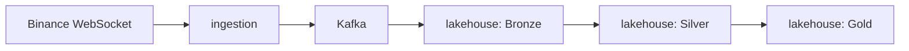

# Arquitectura de datos en streaming para la evaluación del riesgo en mercados de criptoactivos

> Trabajo Fin de Máster | Máster en Big Data & Data Engineering | Universidad Complutense de Madrid


Los mercados de criptoactivos generan un flujo continuo de información procedente de exchanges y redes blockchain. La elevada volatilidad de estos mercados y su funcionamiento ininterrumpido hacen necesario disponer de arquitecturas capaces de procesar grandes volúmenes de datos con baja latencia para facilitar la evaluación del riesgo financiero.

Este repositorio recoge el diseño, implementación y documentación de una arquitectura de datos orientada al procesamiento en streaming de información de mercado. La solución cubre el ciclo de ingesta, persistencia y transformación de eventos, con especial foco en la construcción de un lakehouse modular capaz de refinar los datos desde una capa de captura inicial hasta métricas analíticas preparadas para consumo posterior.

El proyecto se desarrolla como un monorepo gestionado con uv, donde cada módulo representa un componente independiente de la arquitectura y dispone de su propia documentación técnica. Este README ofrece una visión general del proyecto, mientras que la documentación específica de cada paquete describe en detalle su diseño, implementación y funcionamiento.

## Arquitectura general

El sistema sigue un diseño orientado a streaming con una arquitectura en capas que combina ingesta, mensajería, lakehouse y procesamiento analítico. En su estado actual, el flujo principal es el siguiente:



Cada etapa del pipeline se corresponde con un paquete independiente del monorepo:

- **shared**: proporciona infraestructura transversal para configuración, logging y esquemas compartidos.
- **ingestion**: captura eventos de mercado desde Binance y los publica en Kafka, normalizados en un formato interno común.
- **lakehouse**: consume los eventos de Kafka y los procesa a través de las capas Bronze, Silver y Gold, materializando transformaciones progresivas en Delta sobre almacenamiento compatible con S3.

## Stack tecnológico

| Ámbito                           | Tecnología                                        |
| -------------------------------- | ------------------------------------------------- |
| Lenguaje                         | Python 3.12                                       |
| Gestión de paquetes              | uv (workspaces)                                   |
| Mensajería                       | Apache Kafka                                      |
| Validación de contratos de datos | Pydantic                                          |
| Procesamiento streaming          | Spark Structured Streaming                        |
| Almacenamiento de datos          | Delta Lake sobre almacenamiento compatible con S3 |
| Contenerización                  | Docker / Docker Compose                           |
| Testing                          | pytest                                            |
| Linting y formateo               | Ruff                                              |

## Estructura del repositorio

```text
mde-tfm-crypto/
├── packages/
│   ├── shared/          # Infraestructura transversal: config, logging y esquemas
│   ├── ingestion/       # Captura de eventos de Binance y publicación en Kafka
│   └── lakehouse/       # Lakehouse en capas: Bronze, Silver y Gold
├── compose.yml          # Infraestructura de Kafka, Floci y jobs del lakehouse
├── pyproject.toml       # Definición del workspace de uv
├── .env.example         # Variables de entorno de referencia
└── Makefile
```

## Estado actual del proyecto

El proyecto se encuentra en una fase funcional de desarrollo del TFM, con las capas principales ya implementadas. El estado actual de cada componente es el siguiente:

| Paquete   | Estado       | Notas                                                                                                                                                                                                                                |
| --------- | ------------ | ------------------------------------------------------------------------------------------------------------------------------------------------------------------------------------------------------------------------------------ |
| shared    | Implementado | Configuración compartida, logging estructurado y esquemas de mensajes reutilizables, con pruebas unitarias.                                                                                                                          |
| ingestion | Implementado | Captura de los streams de Binance, publicación en Kafka con reintentos y ejecución containerizada.                                                                                                                                   |
| lakehouse | Implementado | Bronze, Silver y Gold ya materializados mediante jobs independientes, con lectura desde Kafka, escritura en Delta y transformaciones analíticas específicas, además de una cobertura de pruebas alineada con las capas del pipeline. |

El desarrollo actual se centra en consolidar el pipeline completo desde la fuente hasta las capas analíticas, manteniendo la trazabilidad y la modularidad del diseño.

## Documentación por paquete

La documentación técnica detallada de cada componente del sistema se encuentra en los siguientes README:

- [Paquete ingestion](./packages/ingestion/README.md): descripción de la arquitectura de ingesta, el flujo de datos desde Binance hasta Kafka, la lógica de WebSocket, la gestión de reintentos y las decisiones de diseño del módulo.
- [Paquete shared](./packages/shared/README.md): explicación de la infraestructura transversal del proyecto, incluyendo configuración compartida, logging uniforme y esquemas de mensajes reutilizables.
- [Paquete lakehouse](./packages/lakehouse/README.md): descripción del patrón medallion, las capas Bronze/Silver/Gold implementadas, los ingestors y jobs concretos, así como las decisiones de diseño del almacenamiento y el procesamiento streaming.

Esta estructura permite navegar desde la visión global del TFM hacia los detalles de implementación de cada módulo sin perder el contexto general del sistema.

## Puesta en marcha

### Prerrequisitos

- Docker y Docker Compose
- Python 3.12
- uv

### Arranque rápido

Desde la raíz del repositorio:

```bash
docker compose up -d
```

Este comando levanta la infraestructura necesaria para el pipeline: Kafka, un endpoint compatible con S3 mediante Floci, el servicio de ingestion y los jobs del lakehouse. El panel de Control Center queda disponible en http://localhost:9021 para inspeccionar los mensajes publicados en tiempo real.

Para más detalle sobre configuración, variables de entorno y ejecución en local, consulta la documentación de cada paquete en los enlaces anteriores.

## Licencia

Este proyecto está bajo la licencia MIT.

Consulta el archivo [LICENSE](./LICENSE) para más detalles.
