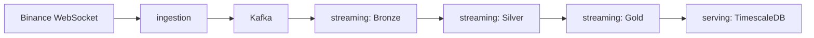

# Arquitectura de datos en streaming para la evaluación del riesgo en mercados de criptoactivos

> Trabajo Fin de Máster | Máster en Big Data & Data Engineering | Universidad Complutense de Madrid


Los mercados de criptoactivos generan un flujo continuo de información procedente de exchanges y redes blockchain. La elevada volatilidad de estos mercados y su funcionamiento ininterrumpido hacen necesario disponer de arquitecturas capaces de procesar grandes volúmenes de datos con baja latencia para facilitar la evaluación del riesgo financiero.

Este repositorio recoge el diseño, implementación y documentación de una arquitectura de datos orientada al procesamiento **en streaming** de información de mercado. La solución cubre todo el ciclo de vida del dato, desde la **ingesta**, el **almacenamiento** y la **transformación**, hasta la **explotación** de métricas que permiten monitorizar la evolución del mercado y apoyar la toma de decisiones basada en datos.

El proyecto se desarrolla como un **monorepo** gestionado con **uv**, donde cada módulo representa un componente independiente de la arquitectura y dispone de su propia documentación técnica. Este README ofrece una visión general del proyecto, mientras que la documentación específica de cada paquete describe en detalle su diseño, implementación y funcionamiento.

## Arquitectura general

El sistema sigue una arquitectura medallion (Bronze / Silver / Gold), alimentada en tiempo real desde el WebSocket de Binance y servida finalmente a través de una base de datos orientada a series temporales.



Cada etapa del pipeline se corresponde con un paquete independiente del monorepo, descrito con detalle en su propia documentación:

- **ingestion**: captura los eventos de mercado desde Binance y los publica en Kafka, normalizados en un formato interno común
- **streaming**: consume los eventos de Kafka y los procesa a través de las capas Bronze, Silver y Gold de un lakehouse en Delta Lake, calculando métricas de riesgo
- **serving**: expone las métricas calculadas para su consulta y análisis

## Stack tecnológico

| Ámbito                           | Tecnología                             |
| -------------------------------- | -------------------------------------- |
| Lenguaje                         | Python 3.12                            |
| Gestión de paquetes              | uv (workspaces)                        |
| Mensajería                       | Apache Kafka (modo KRaft, single-node) |
| Validación de contratos de datos | Pydantic                               |
| Procesamiento streaming          | Spark Structured Streaming             |
| Almacenamiento en lakehouse      | Delta Lake                             |
| Serving                          | TimescaleDB                            |
| Contenerización                  | Docker / Docker Compose                |
| Testing                          | pytest                                 |
| Linting y formateo               | Ruff                                   |

## Estructura del repositorio

```
mde-tfm-crypto/
├── packages/
│   ├── shared/          # Infraestructura transversal: config, logging, esquemas
│   ├── ingestion/        # Captura de eventos de Binance y publicación en Kafka
│   ├── streaming/        # Procesamiento Bronze / Silver / Gold en Delta Lake
│   └── serving/          # Exposición de métricas de riesgo
├── docs/                 # Documentación adicional del TFM
├── docker-compose.yml
├── pyproject.toml        # Definición del workspace de uv
└── Makefile
```

## Estado del proyecto

El proyecto se encuentra en desarrollo activo dentro del cronograma establecido para el TFM. El estado actual de cada componente es el siguiente:

| Paquete   | Estado    | Notas                                                                                                           |
| --------- | --------- | --------------------------------------------------------------------------------------------------------------- |
| shared    | Completo  | Configuración, logging y esquemas compartidos, con pruebas unitarias                                            |
| ingestion | Completo  | Captura de los 3 streams de Binance, publicación en Kafka con reintentos, containerizado, con pruebas unitarias |
| streaming | Pendiente | Procesamiento Bronze / Silver / Gold sobre Delta Lake                                                           |
| serving   | Pendiente | Exposición de métricas en TimescaleDB                                                                           |

## Documentación por paquete

La documentación técnica detallada de cada componente del sistema se encuentra en los siguientes README:

- [Paquete ingestion](./packages/ingestion/README.md): descripción de la arquitectura de ingesta, el flujo de datos desde Binance hasta Kafka, la lógica de WebSocket, la gestión de reintentos y las decisiones de diseño del módulo
- [Paquete shared](./packages/shared/README.md): explicación de la infraestructura transversal del proyecto, incluyendo configuración compartida, logging uniforme y esquemas de mensajes reutilizables

Esta estructura permite navegar desde la visión global del TFM hacia los detalles de implementación de cada módulo sin perder el contexto general del sistema.

## Puesta en marcha

### Prerrequisitos

- Docker y Docker Compose
- Python 3.12
- uv

### Arranque rápido

Desde la raíz del repositorio:

```bash
docker compose up -d
```

Este comando levanta Kafka (con healthcheck), crea automáticamente el topic necesario y arranca el servicio de ingestion, ya conectado a la infraestructura. El panel de Control Center queda disponible en `http://localhost:9021` para inspeccionar los mensajes publicados en tiempo real.

Para más detalle sobre configuración, variables de entorno y ejecución en local sin Docker, consulta la [documentación del paquete ingestion](./packages/ingestion/README.md).

## Licencia

Este proyecto está bajo la licencia MIT.

Consulta el archivo [LICENSE](./LICENSE) para más detalles.
