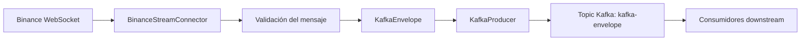

# Paquete ingestion

## 1. Propósito del módulo

El paquete ingestion constituye la capa de entrada del sistema de datos en streaming del TFM. Su responsabilidad no es transformar ni analizar el mercado, sino capturar eventos procedentes de Binance, normalizarlos en un formato interno y enviarlos a un intermediario de mensajería para que otros componentes del pipeline puedan consumirlos de forma desacoplada.

En términos arquitectónicos, este módulo implementa la fase de ingesta del pipeline de datos. Su función es convertir un flujo continuo de mensajes externos, en este caso procedentes de los WebSockets de Binance, en eventos estructurados que puedan ser persistidos, procesados o analizados posteriormente.

La elección de un módulo independiente para esta responsabilidad responde a dos objetivos claros:

- mantener la frontera entre la fuente de datos externa y el resto del sistema
- facilitar la evolución del diseño sin acoplar el pipeline a un proveedor concreto de datos o a una tecnología concreta de transporte

## 2. Contexto dentro del proyecto

Este repositorio implementa una arquitectura de datos orientada a streaming para la evaluación del riesgo en mercados de criptoactivos. Dentro de esa arquitectura, ingestion ocupa el primer eslabón del pipeline:

1. se conecta a una fuente de datos externa
2. recibe mensajes en tiempo real
3. los valida y encapsula
4. los publica en Kafka para su posterior procesamiento

Por tanto, este módulo es el componente encargado de convertir señales de mercado en eventos digitales estandarizados que pueden ser consumidos por capas posteriores de transformación, almacenamiento o análisis.

## 3. Diseño arquitectónico

El diseño del paquete sigue un enfoque modular y orientado a la separación de responsabilidades. La arquitectura se apoya en tres principios fundamentales:

### 3.1 Desacoplamiento entre fuente y canal de distribución

El módulo no publica directamente los mensajes en el sistema de destino desde la lógica de conexión con Binance. En su lugar, encapsula la publicación en una abstracción denominada Producer. Esta decisión permite que el componente de conexión con Binance no necesite conocer detalles de implementación de Kafka ni de ningún otro broker.

La interfaz Producer define el contrato mínimo requerido para la publicación de eventos: conectar, publicar y cerrar. La implementación concreta KafkaProducer adapta ese contrato al cliente asíncrono de Kafka.

Este diseño mejora la mantenibilidad y permite futuras extensiones, por ejemplo para sustituir Kafka por otra infraestructura de mensajería sin modificar la lógica de ingestión. Además, el uso de Kafka aporta un mecanismo implícito de backpressure entre productores y consumidores, discutido con más detalle en la sección 9.1.

### 3.2 Procesamiento asíncrono y no bloqueante

La interacción con WebSockets y con Kafka se implementa de forma asíncrona. Esto es especialmente relevante en un entorno de streaming, donde la latencia y la capacidad de manejar múltiples conexiones concurrentes son factores críticos.

La implementación utiliza asyncio, lo que permite:

- mantener una conexión activa y continua con el servicio de Binance
- gestionar múltiples streams sin bloquear el hilo de ejecución
- evitar la sobrecarga asociada a modelos de programación síncrona

### 3.3 Validación de mensajes y estandarización interna

No todos los mensajes recibidos desde Binance son necesariamente adecuados para su procesamiento posterior. Por ello, el mensaje se encapsula en un objeto KafkaEnvelope, que añade metadatos formales como el símbolo, el tipo de stream y un timestamp de ingestión. El propio proceso de construcción del envelope, respaldado por Pydantic, actúa como validación: si el mensaje no encaja en el contrato esperado, la construcción falla y el mensaje se descarta antes de llegar a Kafka.

Esta decisión permite que los consumidores downstream reciban un formato uniforme, evitando que cada subsistema tenga que interpretar la estructura original del proveedor externo.

En el diseño actual no se ha incorporado un Schema Registry. La razón es deliberada: el proyecto no necesita un nivel de gobernanza de esquemas tan complejo para un alcance inicial, dado que la estructura de mensajes es relativamente sencilla y el número de productores es reducido. En este contexto, Pydantic se ha utilizado como mecanismo principal de contrato de datos, proporcionando validación y tipado estructural de forma suficiente para el objetivo del TFM. Esta decisión reduce la complejidad operativa y acelera el desarrollo, aunque se reconoce que, en una evolución posterior del sistema, un Schema Registry sería una mejora natural para gestionar contratos de datos de forma más robusta y escalable.

## 4. Componentes del paquete

El paquete está organizado en módulos con responsabilidades bien diferenciadas.

### 4.1 Punto de entrada: cli.py

El módulo cli.py actúa como entry point de la aplicación. Su función es:

- construir el objeto de configuración
- inicializar el productor Kafka
- crear los conectores para los streams de Binance definidos
- lanzar todas las conexiones de forma concurrente
- cerrar de forma ordenada los recursos al finalizar la ejecución

Este módulo es el responsable de orquestar el ciclo de vida completo del servicio.

### 4.2 Conector de WebSocket: ws_client.py

La clase BinanceStreamConnector es el componente central de la ingesta. Encapsula la lógica necesaria para:

- abrir una conexión con el endpoint WebSocket de Binance
- suscribirse a uno o varios tickers
- recibir mensajes en streaming
- extraer el símbolo del evento
- crear un KafkaEnvelope
- publicar el payload a través del productor configurado

El conector también incorpora una estrategia de reintento ante interrupciones de red. Cuando la conexión se cierra inesperadamente, el sistema vuelve a intentar la conexión con backoff exponencial y un límite máximo de intentos. Esta decisión mejora la resiliencia del pipeline y evita que una caída temporal del proveedor provoque el fin del servicio.

### 4.3 Productor abstracto: producers/base.py

Este módulo define una interfaz abstracta que representa el contrato de publicación de eventos. La idea de esta abstracción es que la lógica de ingesta no dependa de Kafka directamente, sino de un contrato generalizable.

La separación entre interfaz y implementación es una decisión de diseño importante porque permite:

- probar la lógica de ingestión con mocks o implementaciones alternativas
- introducir otros brokers o middlewares en el futuro
- mantener el código más limpio y extensible

### 4.4 Implementación Kafka: producers/kafka_producer.py

KafkaProducer es la implementación concreta del productor. Utiliza AIOKafkaProducer para publicar mensajes de forma asíncrona en un topic determinado.

El uso del símbolo como clave del mensaje es una decisión relevante. Permite que los eventos del mismo activo se preserven dentro de la misma partición, lo que es útil para mantener un orden relativo de mensajes por activo, algo interesante en escenarios de análisis financiero y detección de eventos. En línea con esta decisión, el topic se ha creado con 3 particiones, una por cada símbolo monitorizado (BTC, ETH, SOL), de modo que en el caso ideal cada símbolo cae en su propia partición y el consumo downstream puede paralelizarse por activo.

### 4.5 Configuración: config/config.py

La configuración del servicio se gestiona mediante un modelo de settings basado en variables de entorno. El uso de un modelo de configuración permite:

- evitar valores hardcodeados
- facilitar el despliegue en entornos distintos
- integrar el servicio con Docker Compose y sistemas de orquestación

La configuración contempla los siguientes elementos:

- la URL del WebSocket de Binance
- los símbolos que se desean monitorizar
- los brokers de Kafka
- el topic de destino
- el nivel de logging del proceso

### 4.6 Esquema de mensaje compartido: shared.schemas

El paquete depende de definiciones comunes del módulo shared. En particular, el envelope utilizado para publicar mensajes incorpora:

- un timestamp de ingestión
- el símbolo del activo
- el tipo de stream
- el payload crudo recibido del proveedor

Esta decisión refuerza la interoperabilidad del sistema y evita que cada componente tenga que definir su propia estructura de mensaje.

## 5. Flujo de datos

El siguiente diagrama resume el flujo principal del módulo.



El flujo se puede describir en detalle de la siguiente manera:

1. El servicio inicia una conexión con Binance
2. Se suscribe a los streams configurados para los símbolos indicados
3. Cada mensaje recibido se analiza y se extrae el símbolo del stream
4. El mensaje se encapsula como KafkaEnvelope
5. El productor lo envía a Kafka con la clave asociada al símbolo
6. Los consumidores posteriores pueden procesar el evento sin depender directamente del formato original de Binance

## 6. Tipos de streams soportados

El esquema actual soporta tres tipos de stream de Binance:

- aggTrade
- bookTicker
- depth10

Esta elección es suficiente para cubrir una base inicial de datos de mercado de alto interés para análisis financiero y evaluación de riesgo, sin introducir un exceso de complejidad en la fase de ingestión.

## 7. Configuración y despliegue

El servicio obtiene su configuración a partir de variables de entorno. Un ejemplo de configuración se encuentra en el archivo .env.example del repositorio.

Variables principales:

- WS_BASE_URL: URL del endpoint WebSocket de Binance
- SYMBOLS: lista de símbolos a suscribir, separada por comas
- KAFKA_BOOTSTRAP_SERVERS: dirección de los brokers de Kafka
- KAFKA_TOPIC: topic de destino
- LOG_LEVEL: nivel de logging del proceso

Ejemplo de configuración:

```bash
WS_BASE_URL=wss://stream.binance.com:9443/stream
SYMBOLS=BTCUSDT,ETHUSDT,SOLUSDT
KAFKA_BOOTSTRAP_SERVERS=localhost:9092
KAFKA_TOPIC=kafka-envelope
LOG_LEVEL=INFO
```

### 7.1 Ejecución con Docker

El proyecto incluye un Dockerfile para el paquete ingestion y un servicio en Docker Compose. La imagen construye el entorno del paquete y ejecuta el entry point del módulo. Esta opción resulta útil para despliegues reproducibles y para la validación del pipeline completo en un entorno controlado. Levantando `docker compose up -d` en el root sin más argumentos, ingestion arranca automáticamente junto al resto de la infraestructura, ya conectado a Kafka mediante la red interna de Docker.

## 8. Pruebas

El paquete cuenta con una batería de pruebas que cubren los principales componentes:

- validación de la construcción de los identificadores de stream
- publicación correcta de mensajes válidos
- rechazo de mensajes mal formados
- comportamiento del productor Kafka ante conexión y publicación
- reintentos de reconexión tras fallos de red

La cobertura de pruebas alcanza el 100% en los módulos de lógica de negocio (`config`, `producers`, `ws_client`). El módulo `cli.py`, al ser el entry point de orquestación, queda deliberadamente fuera del alcance de las pruebas unitarias.

Las pruebas pueden ejecutarse con:

```bash
uv run --package ingestion pytest packages/ingestion/tests --cov=ingestion --cov-report=term-missing
```

## 9. Decisiones de diseño y justificación técnica

### 9.1 Por qué Kafka como punto de entrada del pipeline

Kafka se utiliza como canal de distribución porque encaja bien con un patrón de arquitectura orientada a streaming. Permite:

- desacoplar productores y consumidores
- soportar picos de volumen de eventos
- facilitar la integración con capas posteriores de procesamiento
- incorporar un mecanismo de backpressure natural al separar la velocidad de producción de la de consumo. Cuando la velocidad de consumo de las capas posteriores es menor que la de producción, los mensajes se acumulan en el broker en lugar de provocar una caída inmediata del sistema, lo que permite absorber picos de carga y mantener la estabilidad del pipeline incluso cuando la capacidad downstream no es constante

### 9.2 Por qué un envelope interno y por qué no se usa un Schema Registry

El envelope interno no solo transporta el payload recibido, sino que además añade información estructural y temporal. Este diseño es especialmente útil cuando el sistema evoluciona hacia un pipeline de procesamiento más complejo, ya que evita depender del formato original de cada proveedor.

La decisión de no adoptar un Schema Registry se basa en la simplicidad del caso de uso actual. Dado que el proyecto tiene un alcance controlado, una estructura de mensajes sencilla y un número limitado de productores, Pydantic resulta suficiente para validar y formalizar los contratos de datos. No obstante, esta elección no es la más apropiada para un entorno con múltiples productores, contratos en evolución continua o requisitos estrictos de interoperabilidad y gobernanza de datos. En una siguiente iteración del sistema, la incorporación de un Schema Registry sería una mejora técnica muy razonable.

### 9.3 Por qué la conectividad se gestiona con reintentos

En un entorno de streaming real, las interrupciones temporales son inevitables. La estrategia de reintentos con backoff permite que el servicio sea más robusto frente a fallos transitorios de red o de disponibilidad del proveedor.

### 9.4 Por qué la arquitectura está separada en módulos

La división en módulos busca facilitar la legibilidad, el mantenimiento y la evolución del sistema. Cada componente tiene una responsabilidad concreta y puede ser probado de forma aislada.

## 10. Limitaciones actuales y extensiones naturales

El diseño actual es funcional y suficiente para una primera implementación del TFM, pero presenta algunos límites naturales:

- la ingesta está enfocada en un único proveedor externo: Binance
- no se implementa todavía un control avanzado de particiones ni de throughput
- la gestión de errores se centra en la resiliencia de la conexión, no en la recolección completa de eventos de alta disponibilidad
- la lógica de procesamiento posterior queda delegada a componentes downstream

Estas limitaciones no invalidan el diseño, sino que delimitan el alcance presente del módulo. Como extensiones naturales, podrían incorporarse:

- soporte para más exchanges
- mecanismos de backpressure más explícitos a nivel de aplicación y particiones
- métricas de observabilidad más detalladas
- integración con sistemas de control de calidad de datos
- adopción de un Schema Registry para gobernanza formal de contratos de datos

## 11. Conclusión

El paquete ingestion representa la capa inicial de un sistema de datos en streaming capaz de capturar eventos de mercado en tiempo real y convertirlos en mensajes estructurados y reutilizables. Su diseño combina simplicidad, modularidad y resiliencia, tres atributos clave en un proyecto de ingeniería de datos orientado a la producción.

Desde la perspectiva del TFM, este módulo ilustra una de las decisiones arquitectónicas más importantes del proyecto: la ingesta debe ser fiable, desacoplada y preparada para convertirse en el punto de entrada de un pipeline más amplio de procesamiento analítico y de evaluación de riesgo.
