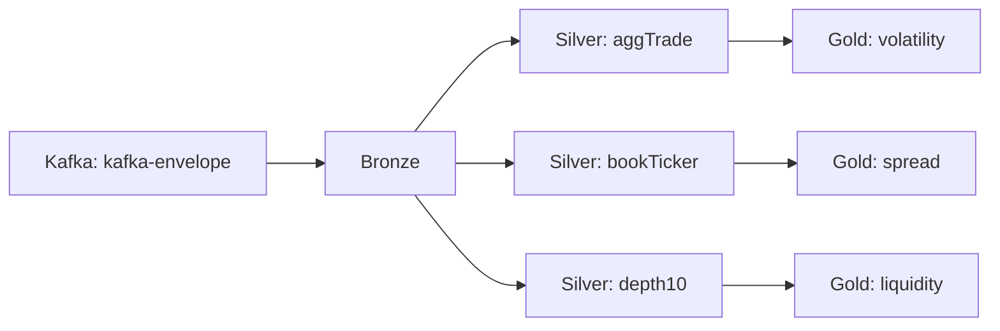

# Paquete lakehouse

## 1. Propósito del módulo

El paquete lakehouse constituye la capa de persistencia y transformación del pipeline de datos del TFM. Su responsabilidad es materializar los eventos ingestionados, estructurarlos progresivamente y exponerlos mediante diferentes niveles de refinamiento para su consumo posterior.

En términos arquitectónicos, este módulo implementa el patrón medallion de capas de datos, un enfoque ampliamente utilizado en sistemas de data lakes para gestionar progresivamente la calidad, estructura y valor de los datos conforme avanzan en el pipeline. El lakehouse, en específico, implementa tres capas diferenciadas: bronze, silver y gold. Cada capa añade valor mediante transformaciones y refinamientos específicos, partiendo desde la captura fidedigna de los eventos originales hasta la generación de conjuntos de datos listos para análisis y toma de decisiones.

La razón fundamental para incorporar un módulo de persistencia independiente responde a dos objetivos complementarios: primero, desacoplar la ingesta del almacenamiento, permitiendo que el sistema pueda soportar variaciones en volumen, velocidad o estructura de datos sin afectar al componente de ingestión; segundo, establecer un repositorio de datos confiable que sirva como fuente única de verdad para análisis posteriores, garantizando reproducibilidad y trazabilidad completa de todas las transformaciones aplicadas.

## 2. Contexto dentro del proyecto

El repositorio implementa una arquitectura de datos orientada a streaming para la evaluación del riesgo en mercados de criptoactivos. Dentro de esa arquitectura, lakehouse ocupa el segundo eslabón del pipeline, inmediatamente después de ingestion:

1. ingestion captura eventos del mercado en tiempo real y los publica en Kafka
2. lakehouse consume esos eventos, los persiste en sus capas y aplica transformaciones progresivas
3. los datos refinados quedan disponibles para análisis, consultas o distribución a sistemas downstream

Este posicionamiento implica que el lakehouse recibe un flujo continuo de eventos estandarizados mediante KafkaEnvelope, documentados en el paquete shared. La persistencia en capas permite que cada fase del análisis acceda a datos con el nivel de refinamiento que necesita, sin depender de transformaciones adicionales realizadas ad hoc.

## 3. Diseño arquitectónico

El diseño del paquete se estructura alrededor de tres decisiones arquitectónicas fundamentales que responden a los requisitos del TFM: procesamiento en streaming, trazabilidad completa de datos e implementación del patrón medallion.

### 3.1 Patrón medallion: capas bronze, silver y gold

El paquete materializa el patrón medallion mediante tres capas de datos, cada una con responsabilidades claramente diferenciadas:

**Capa bronze**: Actúa como buffer de almacenamiento fidedigno de los eventos originales. Recibe los datos directamente desde Kafka sin aplicar transformaciones, preservando el envelope completo y agregando metadatos de trazabilidad procedentes del broker (partición, offset, timestamp). El propósito de esta capa es garantizar que los eventos no se pierdan y que siempre exista una copia íntegra de los datos originales. Esta fidelidad es crítica en análisis financiero, donde la auditoría y la reproducibilidad son requisitos no negociables.

**Capa silver**: Implementa las primeras transformaciones de calidad y estructura. A partir de los datos bronze, esta capa aplica limpieza, validación, enriquecimiento y normalización. El objetivo es convertir eventos en registros estructurados, útiles para análisis y cálculos posteriores. Los datos silver representan un estado intermedio: más refinados que bronze, pero aún cercanos a la captura original, permitiendo depuración y trazabilidad de transformaciones.

**Capa gold**: Proporciona conjuntos de datos completamente refinados, estructurados para consumo analítico. Esta capa implementa lógica de negocio específica, agregaciones, feature engineering y preparación para modelos de aprendizaje automático o análisis avanzados. Los datos gold son el destino final para consumidores especializados que no necesitan interactuar con capas intermedias.

Esta estructura de capas aporta varios beneficios: cada capa permanece independiente, permitiendo evoluciones aisladas; el debugging es más sencillo porque el historial completo de transformaciones es visible; y la reproducibilidad está garantizada porque todos los estadios intermedios quedan persistidos.

#### Implementación actual de las capas del lakehouse

En la implementación actual del paquete ya se han materializado de forma concreta las siguientes capas y transformaciones:

- Bronze persiste los eventos tal como llegan desde Kafka, incluyendo los metadatos de partición, offset y timestamp del broker.
- Silver está dividido en tres ingestors especializados para los distintos streams de Binance: aggTrade, bookTicker y depth10.
- Gold está dividido en tres ingestors orientados a métricas analíticas: volatilidad, spread y liquidez.

El flujo de datos queda resumido de la siguiente manera:

### 3.2 Procesamiento en streaming mediante Spark Structured Streaming

El lakehouse implementa su procesamiento mediante Spark Structured Streaming, no mediante batch. Esta decisión responde a la naturaleza del pipeline: los datos llegan continuamente desde Kafka, y es deseable que se propaguen a través de las capas con la menor latencia posible, permitiendo análisis y reacciones casi en tiempo real.

Spark Structured Streaming proporciona varios mecanismos clave para este escenario:

- **Procesamiento incremental**: Los datos se tratan como un stream infinito, pero internamente Spark los agrupa en microbatches, permitiendo optimizaciones similares a las de batch processing. Esto resulta en eficiencia computacional y tolerancia a fallos.

- **Punto de control (checkpoint)**: Spark mantiene metadatos del progreso en cada capa (posición en Kafka, transformaciones aplicadas) en un directorio de checkpoint. Si el proceso se interrumpe, puede reanudarse desde el último punto de progreso, evitando pérdida de datos o procesamiento duplicado.

- **Integración nativa con Kafka**: Spark consume desde Kafka manteniendo control de offsets, permitiendo paralelización por partición y garantizando exactly-once semantics cuando se combina con checkpointing.

- **Soporte Delta**: Delta Lake, la tecnología de almacenamiento subyacente, proporciona transaccionalidad, versionado y capacidades ACID a nivel de tabla, mejorando la confiabilidad frente a fallos.

La decisión de streaming frente a batch es deliberada en el contexto del TFM: permite demostrar la capacidad del sistema para procesar datos en tiempo real, un requisito típico en sistemas de evaluación de riesgo en mercados. Sin embargo, el mismo patrón arquitectónico sería compatible con procesamiento batch si las necesidades evolucionaran.

### 3.3 Trazabilidad mediante metadatos de Kafka

Una decisión arquitectónica importante es la preservación de metadatos procedentes de Kafka en cada capa. El reader de bronze extrae y mantiene tres datos críticos:

- **partition**: Identifica en qué partición del topic de Kafka se originó el mensaje. Útil para debugging, investigación de anomalías y para mantener orden relativo dentro de cada activo.
- **offset**: Posición del mensaje dentro de la partición. Permite rastrear exactamente dónde estamos en el stream y reconstruir cualquier segmento de historia.
- **kafka_timestamp**: Timestamp proporcionado por Kafka al publicar. Diferente del timestamp de ingestión o del timestamp de negocio del evento; permite medir latencia de end-to-end.

Estos metadatos son preservados en bronze y propagados a silver y gold (cuando es relevante) para mantener trazabilidad completa. En auditoría, debugging o investigación de inconsistencias, estos campos son invaluables.

### 3.4 Abstracción de readers y writers

El procesamiento en el lakehouse se organiza alrededor de abstracciones de lectura (Reader) y escritura (Writer). Esta separación permite que la lógica de transformación (contenida en los Ingestors) sea agnóstica respecto a las fuentes y destinos concretos.

- **Reader**: Define cómo se leen los datos. Para bronze es un KafkaReader que consume desde el topic configurado. Para capas posteriores podrían ser readers que consumen desde las tablas Delta previas.

- **Writer**: Define cómo se persisten los datos. En todas las capas se utiliza DeltaWriter, que escribe en formato Delta con checkpointing para garantizar exactly-once semantics.

- **Ingestor**: Orquesta el ciclo read -> transform -> write. Cada capa implementa la transformación específica que le corresponde. Bronze implementa un transformador nulo, mientras que silver y gold contienen lógica específica.

Esta arquitectura en capas permite que nueva capas de procesamiento se agreguen o modifiquen sin alterar el proceso fundamental.

### 3.5 Pruebas como contratos de datos

Una decisión de diseño complementaria, especialmente relevante en un lakehouse, es utilizar pruebas automatizadas como mecanismo de contrato de datos. El objetivo no es únicamente comprobar que el código funciona, sino garantizar que la estructura de los datos que circulan entre capas no cambia de forma accidental. En este enfoque, las pruebas verifican que las transformaciones de silver y gold mantengan los nombres, tipos y semántica esperados de las columnas que alimentan a las tablas downstream.

Esta idea es especialmente útil en un entorno de streaming, donde una modificación aparentemente menor en el payload de origen o en una transformación intermedia puede romper el esquema de una tabla y propagarse de forma silenciosa a los consumidores analíticos. Si un cambio rompe el contrato esperado, la prueba falla antes de que el problema afecte al pipeline completo. En esa medida, las pruebas actúan como una capa adicional de protección, complementaria a la trazabilidad, el checkpointing y la persistencia en Delta.

## 4. Capa bronze: almacenamiento fidedigno de eventos

La capa bronze es el punto de entrada del lakehouse. Su propósito es simple pero crítico: recibir eventos de Kafka y persistirlos íntegramente, sin transformación, en un almacén durable.

### 4.1 Rol y responsabilidades de bronze

Bronze actúa como intermediario entre Kafka y el almacenamiento persistente. Su responsabilidad es garantizar que:

1. todos los eventos llegados a Kafka sean persistidos sin pérdida
2. no se apliquen transformaciones o interpretaciones que puedan ocultar datos originales
3. la trazabilidad de origen (partición, offset, timestamp de Kafka) se preserve
4. los datos sean inmutables, es decir, no se modifiquen ni se sobrescriban

Esta fidelidad a los datos originales es particularmente importante en análisis financiero. Si un error se descubre downstream en las transformaciones de silver o gold, es crítico poder regresar a bronze, revisar exactamente qué datos originales se recibieron y, si es necesario, reprocesarlos desde cero.

### 4.2 Estructura de los datos en bronze

Los eventos almacenados en bronze tienen la siguiente estructura:

- **symbol**: Símbolo del activo (por ejemplo BTCUSDT, ETHUSDT o SOLUSDT). Procedente del KafkaEnvelope.
- **stream_type**: Tipo de stream de Binance (por ejemplo aggTrade, bookTicker o depth10). Procedente del KafkaEnvelope.
- **ingestion_timestamp**: Timestamp de ingestión, generado por el sistema de ingesta al recibir el evento de Binance. Procedente del KafkaEnvelope.
- **raw_payload**: Campo de texto con el payload completo del evento tal como lo envió Binance, preservado en su forma original.
- **partition**: Partición de Kafka desde la cual procede el mensaje.
- **offset**: Offset dentro de esa partición.
- **kafka_timestamp**: Timestamp asignado por Kafka al mensaje.

La inclusión del campo raw_payload como texto JSON sin un esquema predefinido en la tabla bronze es una decisión deliberada. Permite que bronze sea tolerante a cambios en la estructura de eventos de Binance, sin necesidad de migración de esquema en la tabla Delta. Silver es responsable de extraer, validar y estructurar los campos específicos de cada tipo de stream.

### 4.3 Componentes de la capa bronze

#### 4.3.1 BronzeIngestor (ingestors/bronze.py)

Es la implementación del orquestador de lectura, transformación y escritura para bronze. Como se mencionó, el transformador es nulo: devuelve el DataFrame leído exactamente como es, sin cambios. Su rol es simplemente garantizar que el ciclo de orquestación se ejecute correctamente.

#### 4.3.2 KafkaReader (readers/kafka_reader.py)

El reader especializado en lectura desde Kafka. Realiza las siguientes operaciones:

1. Se conecta al broker de Kafka usando las credenciales proporcionadas.
2. Se suscribe al topic configurado.
3. Inicia la lectura en modo streaming, comenzando desde el offset más antiguo disponible (startingOffsets = earliest).
4. Parsea el contenido JSON de cada mensaje según el esquema de KafkaEnvelope.
5. Extrae y renombra los metadatos de Kafka (partition, offset, timestamp).
6. Devuelve un DataFrame Spark con todos los campos deserializados y disponibles para procesamiento.

Este reader implementa la interfaz Reader abstracta, permitiendo que el código del ingestor no dependa de detalles específicos de Kafka.

#### 4.3.3 DeltaWriter (writers/delta_writer.py)

El writer especializado en escritura en formato Delta. Realiza:

1. Escritura en streaming mediante writeStream.
2. Configuración del trigger: especifica con qué frecuencia se escriben microbatches. En bronze se configura mediante bronze_trigger_interval.
3. Checkpointing: Spark mantiene el progreso en el directorio bronze_checkpoint_path, permitiendo recuperación ante fallos.
4. Modo de salida: append (agregar nuevas filas) o update (modificar filas existentes), según la semántica de la capa. Bronze utiliza append, siendo una tabla de solo inserción.
5. Integración Delta: Los datos se escriben en formato Parquet optimizado con capas de transaccionalidad Delta.

#### 4.3.4 BronzeJob (jobs/bronze_job.py)

Es el punto de entrada ejecutable de la capa bronze. Su responsabilidad es:

1. Cargar la configuración desde variables de entorno.
2. Crear la sesión de Spark con credenciales de S3 (para que Delta pueda acceder al almacenamiento).
3. Instanciar el KafkaReader y DeltaWriter con los parámetros configurados.
4. Crear la instancia de BronzeIngestor.
5. Invocar el método run() para iniciar el ciclo de lectura, transformación y escritura.
6. Manejar interrupciones (Ctrl+C) y excepciones, registrando errores apropiadamente.

Este job es lo que se ejecuta dentro del contenedor Docker o en la plataforma de orquestación.

### 4.4 Decisiones de diseño específicas de bronze

#### 4.4.1 Topic único y particionamiento por símbolo

El sistema ingestion publica todos los eventos en un único topic de Kafka, con el símbolo como clave. Kafka garantiza que mensajes con la misma clave se envíen a la misma partición. Con tres símbolos monitorizados (BTC, ETH, SOL) y tres particiones configuradas en el topic, idealmente cada símbolo ocupa una partición.

Este diseño tiene implicaciones importantes para bronze:

- **Localidad**: El procesamiento downstream puede paralelizarse por símbolo sin riesgo de contención de datos.
- **Orden**: Se preserva el orden relativo de eventos dentro de cada símbolo.
- **Escalabilidad**: Si en el futuro se añaden más símbolos, el particionamiento escala automáticamente.

#### 4.4.2 Tabla Delta con modo append

Bronze utiliza modo append en la escritura Delta. Esto significa que cada microbatch agrega nuevas filas sin modificar las existentes. Esta decisión refleja la naturaleza de los datos de mercado: son hechos históricos que no cambian, solo crece la historia.

Alternativamente, silver y gold podrían utilizar modos más complejos (update, merge) si sus transformaciones implicaran cambios en registros existentes. Bronze mantiene la simplicidad de append.

#### 4.4.3 Almacenamiento en S3 mediante Floci

El almacenamiento físico subyacente es S3-compatible, accedido mediante Floci en el entorno de desarrollo o compatible en producción. Delta escribe sus archivos Parquet en S3, y Spark recupera sus checkpoints del mismo sistema. Esto permite:

- **Escalabilidad**: El almacenamiento no está limitado por el disco local del servicio.
- **Durabilidad**: S3 proporciona replicación y recuperación ante fallos.
- **Portabilidad**: La configuración de credenciales permite cambiar de proveedor sin código.

#### 4.4.4 Checkpoint independiente por capa

Cada capa (bronze, silver, gold) mantiene su propio directorio de checkpoint. Esto permite que:

- Una capa falle sin afectar a las demás.
- El debugging de problemas en una capa sea independiente.
- Se puedan reescribir datos de una capa sin afectar las siguientes.

Por ejemplo, si silver desarrolla un bug y necesita ser reprocesada desde los datos de bronze, el checkpoint de silver se puede limpiar, mientras bronze continúa ingiriendo datos nuevos.

### 4.5 Capas silver y gold implementadas

La implementación real del paquete ya contempla varias transformaciones concretas y separadas por tipo de stream y propósito analítico.

#### 4.5.1 Silver: transformación de eventos de mercado

La capa silver ya está implementada con tres ingestors distintos:

- **SilverAggTradeIngestor**: filtra los eventos de tipo aggTrade, parsea el payload JSON y convierte los campos clave a tipos numéricos y temporales. El resultado es un conjunto de datos con precio, cantidad, identificadores de trade y marca temporal de ejecución.
- **SilverBookTickerIngestor**: transforma los eventos bookTicker en una vista más compacta y analizable, con los mejores precios de compra y venta y sus cantidades asociadas.
- **SilverDepth10Ingestor**: parsea el order book de profundidad y lo aplana en una tabla con una fila por nivel de precio y lado del book (bid/ask), de forma que el análisis de liquidez sea más directo.

Estas transformaciones permiten que bronze mantenga una copia fidedigna del evento original, mientras silver ya ofrece versiones más limpias y estructuradas, adecuadas para análisis posteriores.

#### 4.5.2 Gold: métricas analíticas preparadas para consumo

La capa gold ya incorpora también tres ingestors orientados a métricas de negocio y riesgo:

- **GoldVolatilityIngestor**: calcula volatilidad de precios mediante ventanas temporales de 5 minutos, usando métricas como media, desviación estándar, volumen total y número de trades.
- **GoldSpreadIngestor**: calcula el spread bid-ask y el mid price agregados por ventana temporal, ofreciendo una vista útil para la monitorización de la liquidez y del comportamiento del mercado.
- **GoldLiquidityIngestor**: resume la liquidez media por lado del book y ventana temporal, permitiendo evaluar la profundidad del mercado en función de la cantidad disponible por nivel de precio.

#### 4.5.3 Jobs ejecutables por capa

El paquete ya incluye jobs concretos para lanzar cada una de las capas:

- **Bronze**: bronze_job.py, encargado de consumir desde Kafka y escribir la tabla bronze en Delta.
- **Silver**: silver_agg_trade_job.py, silver_book_ticker_job.py y silver_depth10_job.py.
- **Gold**: gold_volatility_job.py, gold_spread_job.py y gold_liquidity_job.py.

Esta organización permite ejecutar cada transformación como un proceso independiente y facilita el mantenimiento, el debugging y la escalabilidad del pipeline.

## 5. Integración con el resto del sistema

El lakehouse interactúa fundamentalmente con dos componentes externos:

1. **Kafka**: Fuente de datos. El topic de Kafka es el único puente entre ingestion y lakehouse. El desacoplamiento mediante Kafka permite que ambos componentes evolucionen independientemente.

2. **S3 (Floci)**: Destino de persistencia. Todos los datos de todas las capas se escriben en S3, con subdirectorios separados para cada capa y para cada checkpoint. La configuración de credenciales de S3 se parametriza mediante variables de entorno.

La arquitectura de dos extremos (Kafka de entrada, S3 de salida) mantiene la simplicidad y permite que el lakehouse sea stateless desde la perspectiva de su propio ciclo de vida: todo el estado que importa está en Kafka (offsets) o en S3 (datos y checkpoints).
