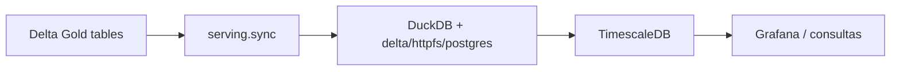

# Paquete serving

## 1. Propósito del módulo

El paquete `serving` constituye una aplicación downstream sencilla dentro del pipeline de datos del TFM: consume los resultados analíticos ya materializados por el lakehouse y los expone en un sistema de consulta y visualización orientado a baja latencia. Su propósito no es producir nuevas métricas ni ejecutar transformaciones complejas de negocio, sino hacer accesibles, de forma operacional y repetible, los datos ya refinados para su consumo por dashboards, consultas ad hoc o aplicaciones externas.

En otras palabras, `serving` representa el ejemplo mínimo de una capa downstream: recibe las tablas Gold almacenadas en Delta sobre S3 y las replica en TimescaleDB, una base de datos diseñada para series temporales y consultas analíticas sobre ventanas de tiempo. Esta separación es deliberada: el lakehouse conserva la lógica de refinamiento y almacenamiento del dato bruto, mientras que `serving` se encarga de preparar esos resultados para consumo inmediato en un sistema downstream.

La solución implementada combina tres tecnologías clave:

- `DuckDB` para la lectura desde Delta y la integración con PostgreSQL/TimescaleDB.
- `S3-compatible storage` (Floci) como origen físico del lakehouse.
- `TimescaleDB` como destino final para observabilidad, monitoreo y consultas temporales.

Esta arquitectura permite desacoplar la capa analítica de la capa de consumo, reduciendo la dependencia de Spark y del propio lakehouse a la hora de servir resultados a un cliente final.

## 2. Contexto dentro del proyecto

Dentro de la arquitectura completa del repositorio, `serving` ocupa una posición final en el pipeline como componente downstream:

1. `ingestion` captura eventos de Binance y los publica en Kafka.
2. `lakehouse` consume esos eventos y los transforma en capas Bronze, Silver y Gold.
3. `serving` sincroniza las tablas Gold hacia una base de datos preparada para consulta.
4. `grafana` consulta la base de datos y representa visualmente los indicadores de riesgo y liquidez.

Este diseño refleja una separación clara de responsabilidades: la complejidad del análisis se concentra en el lakehouse, mientras que la capa `serving` se mantiene ligera y operativa como ejemplo de una aplicación downstream que consume datos ya validados y agregados. La intención no es reconstruir un ELT completo en esta etapa, sino proporcionar una capa de presentación para datos listos para uso analítico y visual.

El proceso de sincronización no se implementa mediante una API REST ni un servicio HTTP. En su lugar, se concibe como un proceso de fondo que ejecuta un bucle periódico, leyendo desde el lakehouse y insertando únicamente los datos nuevos o no presentes en el destino. Esta decisión encaja con la naturaleza del sistema: es un pipeline de datos en streaming/near-real-time, no una aplicación transaccional orientada a peticiones concurrentes.

## 3. Diseño arquitectónico

### 3.1 Patrón de serving como aplicación downstream

La capa `serving` implementa un patrón de sincronización incremental orientado a series temporales y cumple la función de una aplicación downstream simple. Las tablas Gold producidas por el lakehouse quedan alojadas en Delta sobre S3, pero el acceso operativo se realiza contra TimescaleDB. La sincronización se hace por clave de negocio, no por reescritura global del contenido, y tiene un carácter idempotente en la práctica.

Este enfoque es representativo de un patrón típico en arquitecturas de datos modernas: el lakehouse materializa y refina el dato, mientras que una aplicación downstream lo consume para consultarlo, visualizarlo o reutilizarlo en servicios de observación y análisis operativos.

Esto es especialmente importante cuando el sistema se ejecuta en bucles continuos: si el servicio se reinicia o repite una sincronización parcial, no se duplican registros en el destino. La lógica está diseñada para ser robusta frente a reintentos y reejecuciones.

### 3.2 Integración con DuckDB

La implementación central del servicio se apoya en DuckDB, una base de datos analítica embebida con capacidades de extensión. El módulo `serving.sync` crea una conexión DuckDB con las extensiones:

- `delta`: para leer tablas Delta desde rutas S3.
- `httpfs`: para acceder a almacenamiento compatible con S3.
- `postgres`: para conectarse a TimescaleDB y ejecutar inserciones sobre una base externa.

La decisión de depender de DuckDB responde a dos ventajas concretas:

- permite trabajar con una capa muy ligera sin desplegar un motor más pesado ni depender de un cliente adicional especializado
- facilita la mezcla de dos entornos distintos (S3/Delta y PostgreSQL/TimescaleDB) desde una misma conexión, evitando que la capa de serving necesite un adaptador adicional complejo

### 3.3 Idempotencia y deduplicación por clave

Cada tabla Gold se sincroniza con su equivalente en TimescaleDB usando una clave natural del dataset:

- `gold_volatility`: `(symbol, window_start)`
- `gold_spread`: `(symbol, window_start)`
- `gold_liquidity`: `(symbol, side, window_start)`

La operación `sync_table` no hace un reinsertado indiscriminado. En su lugar, comprueba si una fila ya existe y solo inserta aquellas cuya combinación de clave no está presente todavía. Esta estrategia ofrece varios beneficios:

- evita duplicaciones en reiteraciones del mismo proceso
- reduce la carga de trabajo en TimescaleDB
- facilita la evolución del pipeline sin requerir una lógica compleja de upsert o merge

### 3.4 TimescaleDB como sistema de consulta

La elección de TimescaleDB está motivada por la naturaleza temporal de los datos financieros. Las tablas Gold se corresponden con métricas agregadas por ventana de tiempo (`window_start`, `window_end`), por lo que una base de datos orientada a series temporales es una elección adecuada para:

- consultas por rango temporal
- agregaciones sobre ventanas
- visualización en dashboards
- comparación histórica entre activos y intervalos

Además, el repositorio inicializa la base de datos con `CREATE TABLE ...` y `create_hypertable(...)`, lo que convierte estas tablas en tablas optimizadas para series temporales y consultas de alto volumen.

## 4. Flujo de datos



El flujo es simple y explícito:

1. Las tablas Gold ya materializadas en el lakehouse quedan accesibles en S3-compatible storage.
2. El servicio de serving las detecta mediante `delta_scan`.
3. A continuación, compara la clave con la tabla equivalente en TimescaleDB.
4. Inserta solo los nuevos registros.
5. Grafana y otros consumidores leen desde TimescaleDB.

La lógica de sincronización se ejecuta periódicamente a través de un bucle infinito configurado por `sync_interval_seconds`.

## 5. Componentes del paquete

### 5.1 `serving.config`

El módulo de configuración define `ServingSettings`, una clase basada en `BaseSettings` que centraliza la lectura de variables de entorno. Incluye:

- acceso a S3 (`s3_endpoint_url`, `s3_access_key`, `s3_secret_key`)
- rutas de las tablas Gold (`gold_volatility_table_path`, `gold_spread_table_path`, `gold_liquidity_table_path`)
- conexión a TimescaleDB (`timescale_host`, `timescale_port`, `timescale_database`, `timescale_user`, `timescale_password`)
- intervalo de sincronización (`sync_interval_seconds`)

La ventaja de esta configuración centralizada es que el servicio queda desacoplado del entorno de ejecución. El mismo código funciona tanto en local como en contenedor, con la diferencia sólo de las variables de entorno.

### 5.2 `serving.sync`

Este es el módulo funcional principal del paquete. Define tres operaciones clave:

- `get_connection(settings)`: establece la conexión DuckDB, instala las extensiones necesarias y adjunta la base de datos Postgres de TimescaleDB como alias `pg`.
- `_table_exists(con, delta_path)`: comprueba si la tabla Delta está accesible y contiene datos.
- `sync_table(con, delta_path, pg_table, key_columns)`: ejecuta la lógica de inserción incremental con comprobación de duplicados.

La atención a la robustez resulta esencial en este tipo de servicios: si una tabla Delta aún no está disponible o el proceso se reinicia en mitad del ciclo, el servicio debe continuar funcionando sin bloquear el pipeline general.

### 5.3 `serving.main`

`run_sync_loop(settings)` implementa el bucle principal del servicio. A intervalos definidos por la configuración, se sincronizan las tres tablas Gold:

- `gold_volatility`
- `gold_spread`
- `gold_liquidity`

Cada iteración registra información de éxito o error y recupera de forma tolerante mediante `try/except`, de modo que un fallo en una tabla no interrumpa necesariamente el resto de sincronizaciones.

La arquitectura del proceso es muy simple, pero eficaz: es una tarea periódica con responsabilidad única, fácil de desplegar y fácil de supervisar.

### 5.4 Inicialización de TimescaleDB

El script SQL en `packages/serving/init-db/001-init.sql` crea las tablas de destino y convierte cada una en hypertable. Este paso es esencial porque, sin él, `serving` no podría insertar nuevos registros en un esquema compatible con series temporales.

Las tablas creadas son:

- `gold_volatility`
- `gold_spread`
- `gold_liquidity`

Cada una de ellas incluye la clave primaria adecuada y la columna temporal (`window_start`) para habilitar la optimización de TimescaleDB.

## 6. Pruebas y validación

El paquete incluye un conjunto de pruebas unitarias en `packages/serving/tests/test_sync.py` que cubren aspectos clave del comportamiento del servicio:

- validación de la conexión DuckDB y la carga de extensiones
- comprobación del attach a Postgres
- detección de disponibilidad de tablas Delta
- inserción condicional cuando la tabla existe
- no inserción cuando la tabla no existe

Estas pruebas son especialmente relevantes porque validan la lógica de sincronización sin requerir levantar Kafka, Floci, Spark ni TimescaleDB completos. El uso de `unittest.mock` es suficiente para comprobar el comportamiento del servicio en términos de llamadas y condicionales, manteniendo una ejecución rápida y estable.

En el enfoque general del proyecto, estas pruebas actúan como contratos de integración funcional: verifican que la capa `serving` mantiene el comportamiento esperado ante cambios en el entorno o en la firma de la sincronización.

Para ejecutar la validación del paquete, se usa:

```bash
uv run --package serving pytest packages/serving/tests
```

## 7. Ejecución y despliegue

El servicio `serving` está preparado para ejecutarse dentro de la orquestación general del repositorio mediante Docker Compose. El `Dockerfile` del paquete instala el entorno necesario, sincroniza las dependencias del workspace y ejecuta `python -m serving.main` como punto de entrada principal.

El archivo `compose.yml` define los siguientes servicios relevantes:

- `timescaledb`: base de datos destino para las tablas Gold.
- `serving`: servicio principal de sincronización.
- `grafana`: visualización de los datos publicados en TimescaleDB.

Esto permite desplegar todo el ciclo de serving con un único comando:

```bash
docker compose up -d
```

El contenedor `serving` depende de `timescaledb` y de que los jobs del lakehouse hayan sido inicializados.

## 8. Limitaciones y mejoras futuras

El diseño actual de `serving` es funcional y suficiente para el alcance del TFM, pero presenta ciertas limitaciones que conviene reconocer:

- la sincronización es incremental, pero no contempla un mecanismo avanzado de merge/UPSERT para escenarios donde los datos de Gold puedan ser recalculados o corregidos
- la exposición es opcionalmente dependiente de la disponibilidad de la capa lakehouse si una tabla Delta falla, la sincronización del servicio simplemente no inserta filas
- la presencia de `grafana` como consumidor principal sugiere una arquitectura de observabilidad más que de aplicación transaccional, por lo que la capa serving está diseñada para máxima simplicidad operativa más que para un uso de alto throughput transaccional
- la monitorización del servicio se puede reforzar con métricas de latencia, filas insertadas por ciclo, errores de acceso a S3 y estado de las tablas de destino

En una evolución posterior, sería lógico introducir mecanismos de reintención más sofisticados, métricas de salud (Prometheus/OpenTelemetry) y una política más explícita de reconcilación de estados entre el lakehouse y la capa de serving.

## 9. Conclusión

El paquete `serving` es la capa encargada de convertir los resultados analíticos del lakehouse en datos operativos accesibles para consulta y visualización. Su valor no radica en la complejidad del cálculo, sino en la capacidad de convertir resultados sofisticados en una capa de consulta estable, incremental y de bajo costo operativo, como ocurre en cualquier aplicación downstream que consume datos ya procesados.

La implementación actual refleja una decisión arquitectónica clara: separar cálculo, persistencia y exposición. El lakehouse continúa siendo el espacio de transformación analítica, `serving` se convierte en el mecanismo que conecta ese valor con usuarios, dashboards y paneles de observación.
